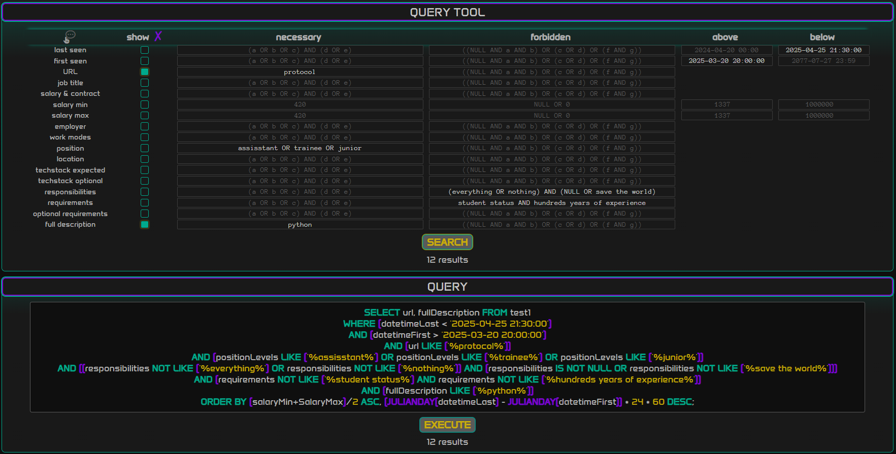
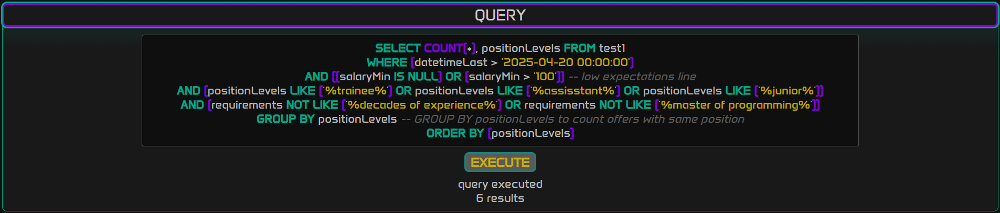

# 
job scraper

### Job scraper is a fullstack scraping application (for theprotocol.it and justjoin.it) controlled via web browser. It can handle multiple scraping processes and a flask server at the same time. All you need to do is provide offer list URL(s) and watch it update the database while you're looking for a job.
<!-- 

  

 -->

<!-- wanted to drag-drop-upload on git website readme edit like the gif above, but it works no more -->
## 
 DEMO 

  

## 
 TECHSTACK 

- **Flask** - backend
- **SQLite** - database
- **Selenium** - scraping functionality
- **JS/CSS/HTML** - frontend
- **Bokeh** - plots and tables

## 
 APPLICATION SECTIONS 

### 
 QUERY TOOL 

Builds an SQL query based on form input. Accepts **nested expressions** like 

`(a OR b OR c) AND (d OR e)` 
or 
`((NULL AND a AND b) OR (c OR d) OR (f AND g))`

Special keywords (**case sensitive**) are: `AND`, `OR` and `NULL`

  

**Default parameters** (database columns - you can adjust them via settings.py) are:
<small>
- **last seen** - date and time when an offer was scraped for the last time

- **first seen** - date and time when an offer was scraped for the first time

- **URL** - link to an offer

- **job title** - job title provided by employer

- **salary & contract** - salary and contract type

- **salary min** - minimal salary converted to [net PLN/month]

- **salary max** - maximum salary converted to [net PLN/month]

- **employer** - employer (or personal information collector)

- **work modes** - work modes (remote, hybrid, home office)

- **position** - position level(s), so-called seniority (junior, mid, senior etc.)

- **location** - location(s) provided by employer

- **techstack expected** - expected techstack

- **techstack optional** - optional techstack

- **responsibilities** - what you're going to do, at least theoretically

- **requirements** - employer's requirements

- **optional requirements** - employer's optional requirements

- **full description** - full description of a job offer, useful when more specific fields couldn't be scraped
</small>

### 
 QUERY 

Displays generated query, which you can **edit** and **execute** as you wish.

  

**HOTKEYS** (active while typing):
- **shift + enter** - execute query (saves query in browser memory)
- **ctrl + ,** - load previous executed query
- **ctrl + .** - load next executed query
- **ctrl + z** - undo typing
- **ctrl + y** - redo typing

### 
 PLOT 

Interactive plot containing query results. Hover mouse over the offer bar to see short offer description. Plot's overall height is declared in settings.py.

On the plot's right side you can see **toggleable tools**:
- **move** - moves plot view
- **zoom** - scroll with cursor on a plot axis to zoom just a single dimension. Scroll on the plot area to zoom both axes.
- **tap** - highlight a single plot bar
- **hover** - separate hover tools for offers with salary specified and unspecified

  

### 
 TABLE 

Interactive table containing query results. Every column is **sortable and resizable**, and every cell is **scrollable in doth directions** **(*shift + scroll to scroll horizontally*)**. You can adjust row and the whole table height in the settings file.

  

### 
 DOWNLOAD 

Download **CSV** containing query results.

### 
 TEST BROWSER 

Open a test browser to select site cookies and save them to **cookies.json**. Or just check if driver is working.

  

### 
 SCRAPING BROWSERS 

Each element with a START button inside is potentially a scraping browser process. You can create as many of them as you like. As well as **start/pause** each one, **anytime**.

  

## 
 SETTINGS 

You can adjust how an application works and looks in **settings.py**. It **auto-reloads**, so just save the file for changes to take effect - no need to stop running app. If css_variables have been changed refresh the page.

settings:
- **DATABASE TABLE NAME** - sets current SQLite table to execute queries on. If a table with the given name does not exist, a new one will be created
- **MAKE BROWSER INVISIBLE** - justjoin HAS TO HAVE (or at least used to have) INVISIBLE (headless) OR ACTIVE (not minimized) window to fetch URLs list and/or some params
- **BROWSER WINDOW WIDTH / HEIGHT** - sets initial browser size, separate for theprotocol and justjoin 
- **SCRAPING WAITING TIMES** - set idle times to avoid bot check - separate for theprotocol and justjoin
- **BOKEH PLOT HEIGHT** - integer [pixels]
- **BOKEH TABLE MAX HEIGHT** - integer [pixels]
- **BOKEH TABLE ROW HEIGHT** - integer [pixels]
- **CSS_VARIABLES** - site appearance - colors etc.   
- **GROSS TO NET MULTIPLIER** - floating point number like 0.77, 0.6 etc. It converts with formula (salaryNet = salaryGross * GROSS_TO_NET_MULTIPLIER) at the time of scraping, not on table display
- **DATABASE_COLUMNS** - adjustable, although changing this while working on existing table with different columns structure will probably cause issues
- **DOCKERIZE_MODE_ACTIVE** - keep it false, unless building linux docker image. Changes settings in main.py and SeleniumBrowser.py to fit docker (ubuntu) requirements

## 
 INSTALLATION ON WINDOWS 

#### Requirements
- **browser:** I ve'been using chrome (check browser version at *chrome://settings/help*) but any browser with its selenium driver should do the job
- **matching browser driver:** Check if chromedriver.exe from the main project's directory works (it's version 134.0). If not, download matching version from https://googlechromelabs.github.io/chrome-for-testing/ and replace **chromedriver.exe (that filename is required**)
- **packages:** run `pip install -r requirements.txt` in the folder where requirements.txt file is. *I suggest installing in a virtual environment as there are quite a lot of them*

#### Once you have a browser, a driver and the packages installed:
- run **main.py** - open terminal in the directory where main.py is and run `python .\main.py` or `python3 .\main.py` (make sure virtual environment is activated if you've created one)
- visit **http://localhost:5000** in your browser of choice and start scraping

## 
 INSTALLATION WITH DOCKER 

- download an image 

  `docker pull letmedockerize/job_scraper:latest`

- run container

  `docker run -p 5000:5000 letmedockerize/job_scraper`

- visit **http://localhost:5000** in your browser of choice and start scraping

note: *docker version works in selenium headless mode (invisible scraping browser window)*